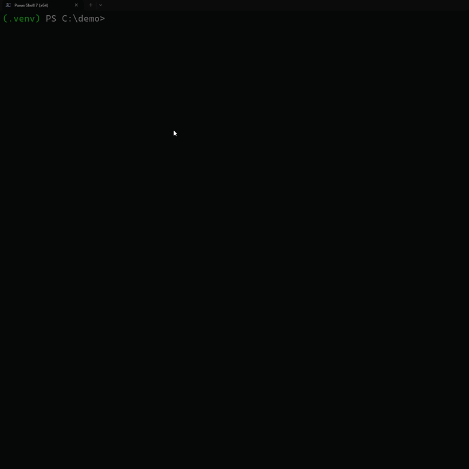

# envsleuth

[](https://github.com/k38f/envsleuth/actions/workflows/tests.yml)
[](https://pypi.org/project/envsleuth/)
[](https://pypi.org/project/envsleuth/)
[](LICENSE)

> 🕵️  The detective for env vars in Python code. Parses your source with AST, finds every `os.getenv()` / `os.environ[]` / `os.environ.get()`, and tells you what's missing from your `.env` file.

No more shipping to prod and realising you forgot `STRIPE_API_KEY`.





## Install

```bash
pip install envsleuth
```

## Usage

```bash
# scan current directory, check against ./.env
envsleuth scan

# specific directory, specific env file
envsleuth scan --path ./src --env .env.production

# CI mode — exits 1 if anything is missing
envsleuth scan --strict

# generate a .env.example from your code
envsleuth generate

# machine-readable output
envsleuth scan --json
```

### Example output

```
Found 6 variables in code
checking against .env

⚠️  AWS_SECRET — not in .env but has default in code (probably ok)
✅ DATABASE_URL
✅ DEBUG
❌ REDIS_URL — missing from .env
     at src/app.py:7
✅ SECRET_KEY
❌ STRIPE_API_KEY — missing from .env
     at src/app.py:6

⚠️  1 dynamic usage (variable name computed at runtime, can't check statically)
     src/app.py:12  →  getenv(name)

ℹ  1 variable in .env not referenced in code: UNUSED_VAR

3 ok  1 with default  2 missing
```

## What it detects

Works with all three common patterns:

```python
import os

a = os.getenv("A")              # required — must be in .env
b = os.getenv("B", "fallback")  # has default — warned but not required
c = os.environ["C"]             # required (would raise KeyError without)
d = os.environ.get("D")         # required
```

Also handles aliased imports:

```python
from os import getenv, environ
import os as sys_os

a = getenv("A")
b = environ["B"]
c = sys_os.getenv("C")
```

Variables with names computed at runtime (e.g. `os.getenv(f"PREFIX_{x}")`) can't be checked statically — they're reported in a separate warning section so you know they exist.

## `envsleuth generate`

Scans your code and writes a `.env.example` with every variable found, a comment pointing at where it's used, and the default value from code if there is one:

```bash
$ envsleuth generate
Wrote 6 variables to .env.example

$ cat .env.example
# Generated by envsleuth — edit this file before committing.
# Each variable below is used somewhere in your code.

# used at src/app.py:8
AWS_SECRET=default-value

# used at src/app.py:3
DATABASE_URL=

# used at src/app.py:5
DEBUG=false
...
```

Use `--force` to overwrite an existing file, `--output path/to/file` to write elsewhere.

## `.envignore`

Exclude variables from the "missing" check with glob patterns — one per line:

```
# .envignore
TEST_*
LEGACY_*
DEBUG_TOOL
```

Great for vars that come from CI, Docker, or your shell rc files rather than the local `.env`.

## CI usage

GitHub Actions:

```yaml
- name: Check env vars
  run: |
    pip install envsleuth
    envsleuth scan --env .env.example --strict
```

pre-commit:

```yaml
# .pre-commit-config.yaml
- repo: local
  hooks:
    - id: envsleuth
      name: envsleuth
      entry: envsleuth scan --strict
      language: system
      pass_filenames: false
```

## CLI reference

### `envsleuth scan`

| Flag | Description |
| --- | --- |
| `--path`, `-p` | Directory or file to scan. Default: `.` |
| `--env` | Path to `.env` file. Default: `./.env` |
| `--envignore` | Path to `.envignore`. Default: `./.envignore` if present |
| `--strict` | Exit with code 1 if vars are missing |
| `--json` | JSON output for CI pipelines |
| `--no-color` | Disable ANSI colors (also honours `NO_COLOR` env var) |
| `--exclude DIR` | Extra directory name to skip. Can be repeated |
| `--ext .EXT` | Extra file extension to scan (e.g. `.pyi`). Can be repeated |
| `--verbose`, `-v` | Show usage locations for every variable |

### `envsleuth generate`

| Flag | Description |
| --- | --- |
| `--path`, `-p` | Directory or file to scan. Default: `.` |
| `--output`, `-o` | Where to write. Default: `./.env.example` |
| `--force`, `-f` | Overwrite existing output file |
| `--exclude`, `--ext` | Same as in `scan` |

## How it compares

| | envsleuth | [dotenv-linter](https://github.com/dotenv-linter/dotenv-linter) | [python-decouple](https://github.com/HBNetwork/python-decouple) |
| --- | --- | --- | --- |
| Scans your **code** for env var usages | ✅ | ❌ | ❌ |
| Lints the **.env file itself** | ❌ | ✅ | ❌ |
| Runtime config reader with casting | ❌ | ❌ | ✅ |
| Generates `.env.example` from code | ✅ | ❌ | ❌ |
| Language | Python | Rust | Python |

envsleuth is the only tool here that understands your **source code**. The others either look at your `.env` file in isolation, or read env vars at runtime.

## Dependencies

- [click](https://click.palletsprojects.com/) — CLI
- [python-dotenv](https://github.com/theskumar/python-dotenv) — `.env` parsing
- [flashbar](https://github.com/k38f/flashbar) — progress bar (a tiny zero-dep lib I wrote; envsleuth uses it when scanning 20+ files)

The scanner itself uses only the Python standard library (`ast`).

## License

MIT
